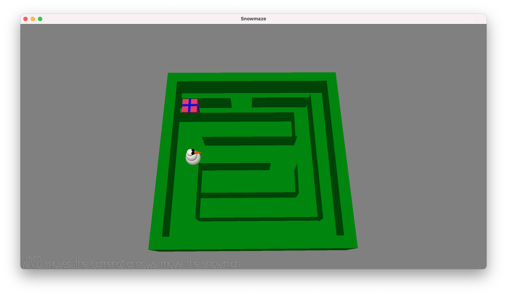

# Snowmaze

Author: Sacha Bartholme

Design: The main character is a snowman consisting of a hierarchy of objects. Collisions with the walls were computed using bounding boxes of world coordinates.

Screen Shot:

How To Play:

Find your way through the maze and get to the present. Use the arrows to navigate the snowman and WASD to move the camera.

This game was built with [NEST](NEST.md).
